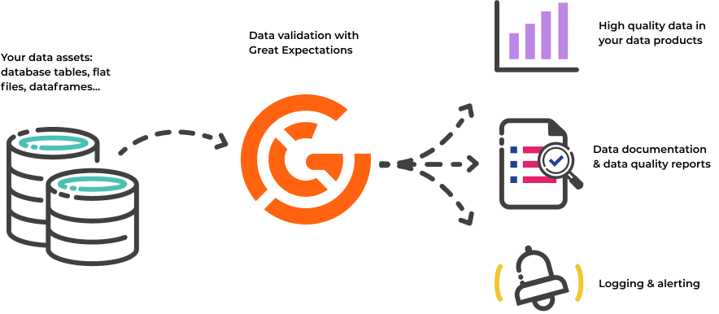
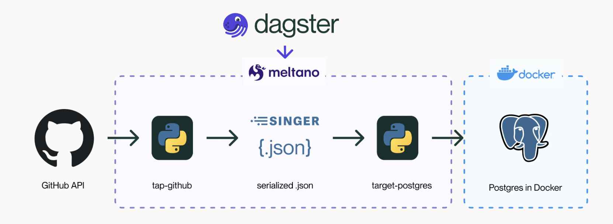

# Lesson

## Brief

### Preparation

We will be using the `elt` and `dagster` environments for this lesson. We will also be using google cloud (for which the account was created in the previous units) in this lesson.


### Lesson Overview

In this lesson, we will continue with orchestration from where we left off in the previous unit. We will use `Dagster` to orchestrate and schedule the `Meltano` and `Dbt` pipelines.

We will also dive into the concept of data testing, which is an important part of data quality management. We will use `Great Expectations`, an open-source library for data testing.

---


## Part 1 - Hands-on with Data Testing (Great Expectations)

### Background

Data testing is an important part of data quality management. It is the process of verifying that data satisfies the expected properties. It is also known as data validation, data quality assurance, data quality control, data quality assessment, etc.

Great Expectations is an open-source library for data testing. It is a Python library that helps you write, organize, evaluate, and share your data validation. It also provides a user interface for visualizing the results of the data tests. It can be used with any data source such as files, databases, data lakes, etc.



### Create a Great Expectations Project (Data Context)

First, reactivate the conda environment.

```bash
conda activate elt
```

Please see the notebook GX_lessons.ipynb


## Part 2 - Testing Dbt

Back in unit 2.5, we configured some simple tests in dbt to check for _null values_, _uniqueness_ and _foreign key constraints_. We have copied the dbt project `liquor_sales` from unit 2.5 to this unit. You can find the tests in the `schema.yml` files in the `/models` directory.

However, the built-in tests are limited in scope and functionality. We can expand on the tests using `dbt_utils`- a utility macros package for dbt and `dbt-expectations`- an extension package for dbt inspired by Great Expectations to write more comprehensive tests.

### Installing and Configuring `dbt_utils`

We will be using the same `elt` conda environment. The `liquor_sales` dbt project folder is under `extra` folder. Use the command `cd extra/liquor_sales` to navigate to the folder.

Create a new `packages.yml` file:

```yml
packages:
  - package: dbt-labs/dbt_utils
    version: 1.1.1
```

Run `dbt deps` to install the package. Refer to the [documentation](https://hub.getdbt.com/dbt-labs/dbt_utils/latest/) for supported tests.

Let's add some additional tests to the `fact_sales` model at the end of `models/schema.yml`:

```yml
- name: date
  tests:
    - dbt_utils.accepted_range:
        min_value: "PARSE_DATE('%F', '2012-01-01')"
        max_value: "CURRENT_DATE()"
```

Here, we are using `dbt_utils.accepted_range` to check if the `date` field is within the range of `2012-01-01` and `CURRENT_DATE()`.

We can also add the `dbt_utils.expression_is_true` test to check if the `sale_dollars` field is the product of `bottles_sold` and `state_bottle_retail` as below.

Note that the expression below involves multiple columns, and hence the test must be outside the `columns:` section so as to apply it as a model-level test (put it below `description:`)

```yml
tests:
  - dbt_utils.expression_is_true:
      expression: "ROUND(sale_dollars, 1) = TRUNC(bottles_sold * state_bottle_retail, 1)"
```

Here, we use `ROUND` to round the values to 1 decimal place and compare them.

Run the tests using `dbt test`. Observe which tests pass and which fail.

> 1. Run a SQL query to check which rows failed.
> 2. Run a SQL query to get the min and max values of `pack` and `bottle_volume_ml` in `liquor_sales_star.dim_item`.
> 3. Then, set the `min_value` and `max_value` in the `dbt_utils.accepted_range` test in `models/star/schema.yml` to the min and max values respectively.

### Installing and Configuring `dbt-expectations`

Add the following to `packages.yml`:

```yml
- package: calogica/dbt_expectations
  version: 0.10.0
```

Run `dbt deps` to install the package. Refer to the [documentation](https://hub.getdbt.com/calogica/dbt_expectations/latest/) for supported tests.

Let's add some tests to check the column types in `fact_sales`:

```yml
- name: invoice_and_item_number
  tests:
    - dbt_expectations.expect_column_values_to_be_of_type:
        column_type: string
- name: date
  tests:
    - dbt_expectations.expect_column_values_to_be_of_type:
        column_type: date
```

> 1. Add type tests for all the columns in `fact_sales`, `dim_item` and `dim_store`.
> 2. Can you think of any other tests that we can add to the models?

--- 

## Extra - Hands-on with Orchestration I

We will be using the `dagster` environment. Use the command `conda activate dagster` to activate the environment.

This will be covered in class, with demo on `extra/dagster_orchestration_dbt`

```bash
cd extra/dagster_orchestration_dbt
```

Note that to run dagster successfully, you need to:
1. Input your Github personal access token in `extra/dagster_orchestration_dbt/dagster_orchestration/assets/duck.py`
2. In `extra/dagster_orchestration_dbt/profiles.yml`, enter your GCP project ID in `project:`

After the configuration above, we can run dagster using the command below:
```bash
dagster dev
```

## Extra - Hands-on with Orchestration II

In the previous unit, combining Meltano and Dbt, we have an end-to-end ELT (data ingestion and transformation) pipeline. However, we ran the pipelines manually. Now, we will use Dagster to orchestrate the pipelines and schedule them to run periodically.

### Background

We can orchestrate Meltano and Dbt pipelines using Dagster. By executing the commands from within Dagster, we get to take full advantage of its capabilities such as scheduling, dependency management, end-to-end testing, partitioning and more.



### Create a Dagster Project

We will be using the meltano project we created in module 2.6. Make sure we are not in any subfolder.

First, we will create a Dagster project and use it to orchestrate the Meltano pipelines.

```bash
dagster project scaffold --name meltano-orchestration
cd meltano-orchestration
```

### Using the Dagster-Meltano library

Replace the content of `meltano-orchestration/meltano_orchestration/definitions.py` with the following:

```python
from dagster import Definitions, ScheduleDefinition, job
from dagster_meltano import meltano_resource, meltano_run_op


@job(resource_defs={"meltano": meltano_resource})
def run_elt_job():
   tap_done = meltano_run_op("tap-github target-bigquery")()

# Addition: a ScheduleDefinition the job it should run and a cron schedule of how frequently to run it
elt_schedule = ScheduleDefinition(
    job=run_elt_job,
    cron_schedule="0 0 * * *",  # every day at midnight
)

defs = Definitions(
    schedules=[elt_schedule],
)
```

Then start the UI by running

```bash
dagster dev
```

### Launching a Test Run of the Schedule

Look for the 'Launchpad' tab after clicking on the job name in the left nav.

When initiating a run in Dagster, we have to pass along configuration variables at run time such as the location of the Meltano project:

```yml
resources:
  meltano:
    config:
      project_dir: #full-path-to-the-meltano-ingestion-project-directory
ops:
  tap_github_target_bigquery:
    config:
      env:
        TAP_GITHUB_AUTH_TOKEN: #your-github-personal-access-tokens
```

Then click 'Launch run'. We have just executed the `meltano run tap-github target-bigquery` command from within Dagster.

### Using Dbt with Dagster

We can also orchestrate Dbt with Dagster.

First, activate the conda environment.

```bash
conda activate elt
```

Create a file named `profiles.yml` in the `resale_flat` dbt project directory in Unit 2.6 with the following content:

```yml
resale_flat:
  outputs:
    dev:
      dataset: resale_flat
      job_execution_timeout_seconds: 300
      job_retries: 1
      keyfile: #full-path-to-the-service-account-key-file
      location: US
      method: service-account
      priority: interactive
      project: #your-GCP-project-id
      threads: 1
      type: bigquery
  target: dev
```

Please use the above format in order to be compatible with dagster. 

Then create a new Dagster project that points to the directory.

```bash
dagster-dbt project scaffold --project-name resale_flat_dagster --dbt-project-dir #full-path-to-the-resale-flat-dbt-project-directory
```

To run the dagster webserver:

```bash
cd resale_flat_dagster
DAGSTER_DBT_PARSE_PROJECT_ON_LOAD=1 dagster dev
```

We can now trigger the Dbt pipeline from within Dagster by selecting the assets and clicking 'Materialize selected'.

We can even schedule the pipeline to run daily by uncommenting the code in `resale_flat_dagster/resale_flat_dagster/schedules.py`. Now click 'Reload definitions' and you will see the new schedule.
